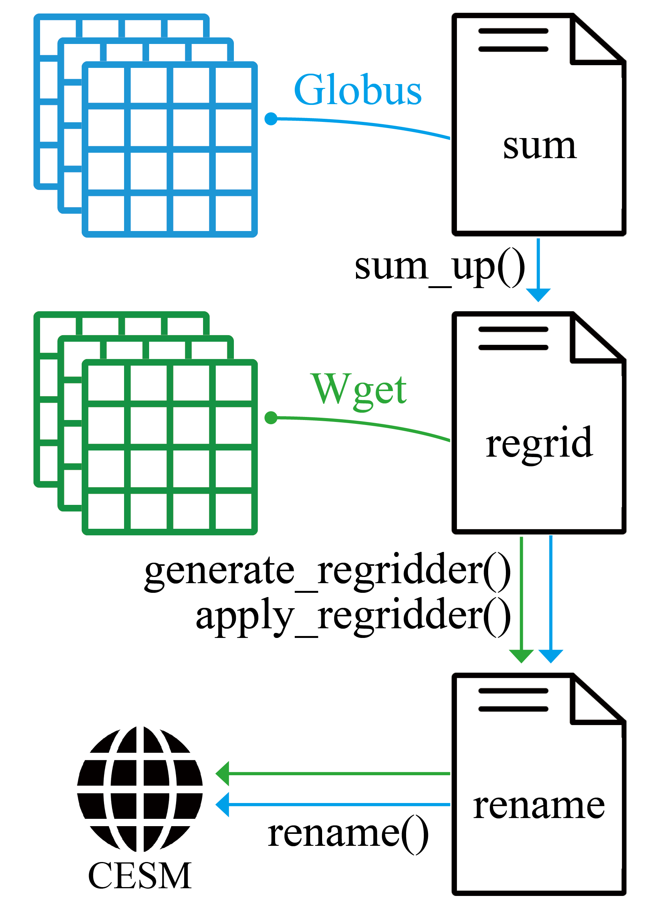

# IPTpy

IPTpy is a Python-based tool designed to process input data for [CESM](https://www.cesm.ucar.edu/). It serves as a partial replacement for the NCL-based [Input Processing Tool (IPT) for MUSICA](https://github.com/NCAR/IPT/tree/master), which is no longer maintained or updated by the [NSF National Center for Atmospheric Research (NCAR)](https://ncar.ucar.edu/). 

IPTpy enables users to generate global anthropogenic emissions from [Copernicus Atmosphere Monitoring Service (CAMS)](https://atmosphere.copernicus.eu) or [Community Emissions Data System (CEDS)](https://www.pnnl.gov/projects/ceds) inventories for the finite volume dynamic core (FV dycore), covering the most recent historical data. Compared to the original, IPTpy offers greater flexibility by allowing users to generate specific species and specify data on a monthly basis. 

# Function1: Emission

***Table 1** Comparison of IPT and IPTpy for processing emission inputs*

| Feature                                     | [IPT](https://github.com/NCAR/IPT)                           | [IPTpy](https://github.com/envdes/IPTpy)                     |
| ------------------------------------------- | ------------------------------------------------------------ | ------------------------------------------------------------ |
| Functions                                   | Processing anthropogenic and biomass emissions for FV and SE dycores | Processing anthropogenic emissions for FV dycore             |
| Global anthropogenic emission inventories   | [CAMS-GLOB-ANTv4.2](https://ads.atmosphere.copernicus.eu/datasets/cams-global-emission-inventories?tab=overview), [CEDSv2017_05_18](https://doi.org/10.5194/gmd-11-369-2018) | [CAM-GLOB-ANTv5.3](https://permalink.aeris-data.fr/CAMS-GLOB-ANT), [CAM-GLOB-ANTv6.2](https://permalink.aeris-data.fr/CAMS-GLOB-ANT), [CEDSv2021_04_21](https://data.pnnl.gov/dataset/CEDS-4-21-21) |
| Global biomass burning emission inventories | [FINN](https://www2.acom.ucar.edu/modeling/finn-fire-inventory-ncar), [QFED](https://gmao.gsfc.nasa.gov/research/science_snapshots/global_fire_emissions.php#:~:text=The%20Quick%20Fire%20Emissions%20Dataset%20%28QFED%29%20was%20developed,Observing%20System%20%28GEOS%29%20modeling%20and%20data%20assimilation%20systems.) | Not applicable yet                                           |
| Emission species                            | Generates all species by default (no user selection).        | Allows users to select specific species as needed.           |
| Emission period                             | Selected by year(s).                                         | Selected by year(s) and months                               |

- While IPT-py does not yet replicate all IPT functionalities, contributions are welcome to enhance its capabilities further.

## Anthropogenic Emission

***Table 2** Comparison of Global Anthropogenic Emission Inventories*

| Feature            | [CAMS-GLOB-ANT](https://permalink.aeris-data.fr/CAMS-GLOB-ANT) | [CEDSv2021_04_21](https://data.pnnl.gov/dataset/CEDS-4-21-21) |
| ------------------ | ------------------------------------------------------------ | ------------------------------------------------------------ |
| Time step          | Monthly                                                      | Monthly                                                      |
| Period             | 2000-01-01 to present                                        | 1750-01-16 to 2019-12-16                                     |
| Version            | v5.3, v6.2                                                   | v2021_04_21                                                  |
| Spatial resolution | 0.1°x0.1°                                                    | 0.5°x0.5°                                                    |
| Download method    | [Wget](https://permalink.aeris-data.fr/CAMS-GLOB-ANT)        | [Globus (1750-2019)](https://www.globus.org/data-transfer), [Wget (1950-2019)](https://permalink.aeris-data.fr/CEDS)) |

### Script Structure

### Troubleshooting Tips
- **Verify Default Input Data First:** Ensure that CESM job scripts run successfully using the default input data before incorporating user-customized input data. This helps isolate potential errors caused by modifications. For issues unrelated to input data, refer to [DiscussCESM Forums](https://bb.cgd.ucar.edu/cesm/) for support.
- **Understand Emission Input Interpolation**: Emission datasets such as CEDS provide data on the 16th of each month. If a simulation starts on **01 Jan 2015**, the input must include data from **16 Dec 2014** to enable interpolation between **16 Dec 2014 and 16 Jan 2015**. Similarly, if a simulation extends to the **end of 2015**, the input must include **16 Jan 2016** to interpolate emissions from **16 Dec 2015 to 16 Jan 2016**.

### Error Cases (Selected)

**[error1](./troubleshooting/error1/)**: *imp_sol: step failed to converge @ (lchnk,vctrpos,nstep,dt,time) =     1281     431       1   11.25000       22.50000*  

**notes**: If the simulation stops due to CAM failing to converge, it likely indicates an issue with the input data, such as missing values (fill values) instead of actual data.

# Collaboration & Reach-out

- Contributors: [Yuan Sun](https://github.com/YuanSun-UoM), [Zhonghua Zheng](https://zhonghuazheng.com) (zhonghua.zheng@manchester.ac.uk)
- If you’re interested in contributing to the development of a Python-based IPT for [CESM](https://github.com/ESCOMP/CESM)/[CAM-Chem](https://wiki.ucar.edu/display/camchem/Home)/[MUSICA](https://wiki.ucar.edu/display/MUSICA/MUSICA+Home)/[CTSM](https://github.com/ESCOMP/CTSM), please reach out to [Yuan Sun](https://github.com/YuanSun-UoM) or submit an issue on the [Issues](https://github.com/envdes/IPTpy/issues) page for any ideas or suggestions. We will respond as soon as possible.
- We also provide [testing scripts](./tests) for validating IPTpy functions in CESM. 
