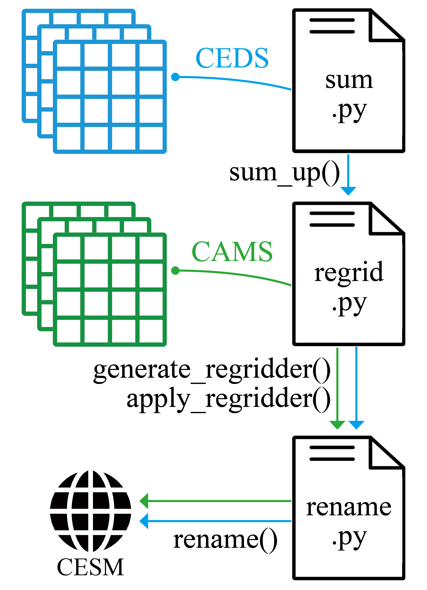

.. currentmodule:: IPTpy

.. _examples:

Usage Examples
==============
We provides two examples for using IPTpy to process CAMS-GLOB-ANT and CEDSv2021_04_21 data. Users can taste the basic functions of IPTpy through `Jupyter Notebook <https://jupyter.org>`_.

.. grid:: 1 1 2 2
    :gutter: 2

    .. grid-item-card::  CAMS-GLOB-ANT
        :class-title: custom-title
        :class-body: custom-body
        :link: notebooks/examples/CAMS-GLOB-ANT.html

        Use rename and regrid fuctions
        
        .. image:: _static/images/icons/public.svg
            :height: 30px
            :width: 30px

    .. grid-item-card::  CEDSv2021_04_21
        :class-title: custom-title
        :class-body: custom-body
        :link: notebooks/examples/CEDSv2021_04_21.html

        Use sum, rename and regrid fuctions

        .. image:: _static/images/icons/public.svg
            :height: 30px
            :width: 30px

.. raw:: html

    

.. toctree::
   :maxdepth: 2
   :hidden:

   CAMS-GLOB-ANT <notebooks/examples/CAMS-GLOB-ANT.md>
   CEDSv2021_04_21 <notebooks/examples/CEDSv2021_04_21.md>
   

