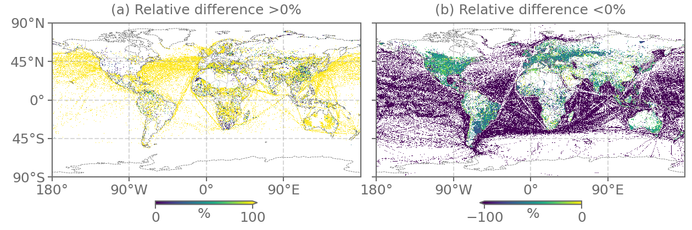

# Overview

IPTpy enables users to generate global anthropogenic emissions from [Copernicus Atmosphere Monitoring Service (CAMS)](https://atmosphere.copernicus.eu) or [Community Emissions Data System (CEDS)](https://www.pnnl.gov/projects/ceds) inventories for the finite volume dynamic core (FV dycore) in Community Atmosphere Model (CAM), covering the most recent historical data. Compared to the original, IPTpy offers greater flexibility by allowing users to generate specific species and specify data on a monthly basis. 

## Why IPTpy?

The differences between IPT and IPTpy include the programming language, supported model dycores, inventory versions, and output method, as summarized in **Table 1**. 

***Table 1** Comparison between Input Processing Tools (IPT) and Python-based IPT (IPTpy).* 

| Feature                                               | [IPT](https://github.com/NCAR/IPT)                           | [IPTpy](https://github.com/envdes/IPTpy)                     |
| ----------------------------------------------------- | ------------------------------------------------------------ | ------------------------------------------------------------ |
| Function                                              | Processing anthropogenic and biomass emission for FV and spectral element (SE) dycores | Processing anthropogenic emissions for FV dycores            |
| Programming language                                  | [NCAR Command Language (NCL)](https://www.ncl.ucar.edu/)     | Python                                                       |
| Supported global anthropogenic emission inventories   | [CAMS-GLOB-ANTv4.2](https://ads.atmosphere.copernicus.eu/datasets/cams-global-emission-inventories?tab=overview)[^1], [CEDSv2017_05_18](https://doi.org/10.5194/gmd-11-369-2018) | [CAMS-GLOB-ANTv5.3](https://permalink.aeris-data.fr/CAMS-GLOB-ANT) [^2][^3], [CAMS-GLOB-ANTv6.1](https://eccad.sedoo.fr/#/metadata/479), [CEDSv2021_04_21](https://data.pnnl.gov/dataset/CEDS-4-21-21) |
| Supported global biomass burning emission inventories | [FINN](https://www2.acom.ucar.edu/modeling/finn-fire-inventory-ncar), [QFED](https://gmao.gsfc.nasa.gov/research/science_snapshots/global_fire_emissions.php#:~:text=The%20Quick%20Fire%20Emissions%20Dataset%20%28QFED%29%20was%20developed,Observing%20System%20%28GEOS%29%20modeling%20and%20data%20assimilation%20systems.) | Not applicable                                               |
| Species                                               | Generates all species by default (no user selection)         | Allows users to select specific species as needed            |
| Period                                                | Selected by year(s)                                          | Selected by year(s) and months                               |

- While IPT-py does not yet replicate all IPT functionalities, contributions are welcome to enhance its capabilities further.

- Emission data varies across versions. 
  - For example, black carbon emissions exhibit notable differences between CAMS-GLOB-ANTv4.2 and CAMS-GLOB-ANTv5.3. On 1 January 2019, the relative difference $\frac{\text{CAMS-GLOB-ANTv4.2} - \text{CAMS-GLOB-ANTv5.3}}{\text{CAMS-GLOB-ANTv5.3}} \times 100\%$ exceeds 100% (**Figure 1**a) or $-$100% (**Figure 1**b), indicating that CAMS-GLOB-ANTv5.3 reports substantially lower emissions than CAMS-GLOB-ANTv4.2. 
  
     
  
    ***Figure 1** Relative difference in black carbon between CAMS-GLOB-ANTv4.2 and CAMS-GLOB-ANTv5.3 on 1 January 2019.*
  
     
  
  - CEDS releases have also introduced changes in history emissions. For details, refer to the [CEDS release notes](https://github.com/JGCRI/CEDS/wiki/Release-Notes). 

# Acknowledgment

This work used the [ARCHER2 UK National Supercomputing Service](https://www.archer2.ac.uk) and [JASMIN, the UK’s collaborative data analysis environment](https://www.jasmin.ac.uk).

# Notes

[^1]: Hoesly, R. M., Smith, S. J., Feng, L., Klimont, Z., Janssens-Maenhout, G., Pitkanen, T., ... & Zhang, Q. (2018). Historical (1750–2014) anthropogenic emissions of reactive gases and aerosols from the Community Emissions Data System (CEDS). *Geoscientific Model Development*, *11*(1), 369-408. [https://doi.org/10.5194/gmd-11-369-2018](https://doi.org/10.5194/gmd-11-369-2018) 
[^2]: Soulie, A., Granier, C., Darras, S., Zilbermann, N., Doumbia, T., Guevara, M., ... & Smith, S. Global Anthropogenic Emissions (CAMS-GLOB-ANT) for the Copernicus Atmosphere Monitoring Service Simulations of Air Quality Forecasts and Reanalyses, ECCAD, [https://doi.org/10.24380/eets-qd81](https://doi.org/10.24380/eets-qd81)
[^3]: Soulie, A., Granier, C., Darras, S., Zilbermann, N., Doumbia, T., Guevara, M., ... & Smith, S. (2024). Global anthropogenic emissions (CAMS-GLOB-ANT) for the Copernicus Atmosphere Monitoring Service simulations of air quality forecasts and reanalyses. *Earth System Science Data*, 16(5), 2261-2279. [https://doi.org/10.5194/essd-16-2261-2024](https://doi.org/10.5194/essd-16-2261-2024)
