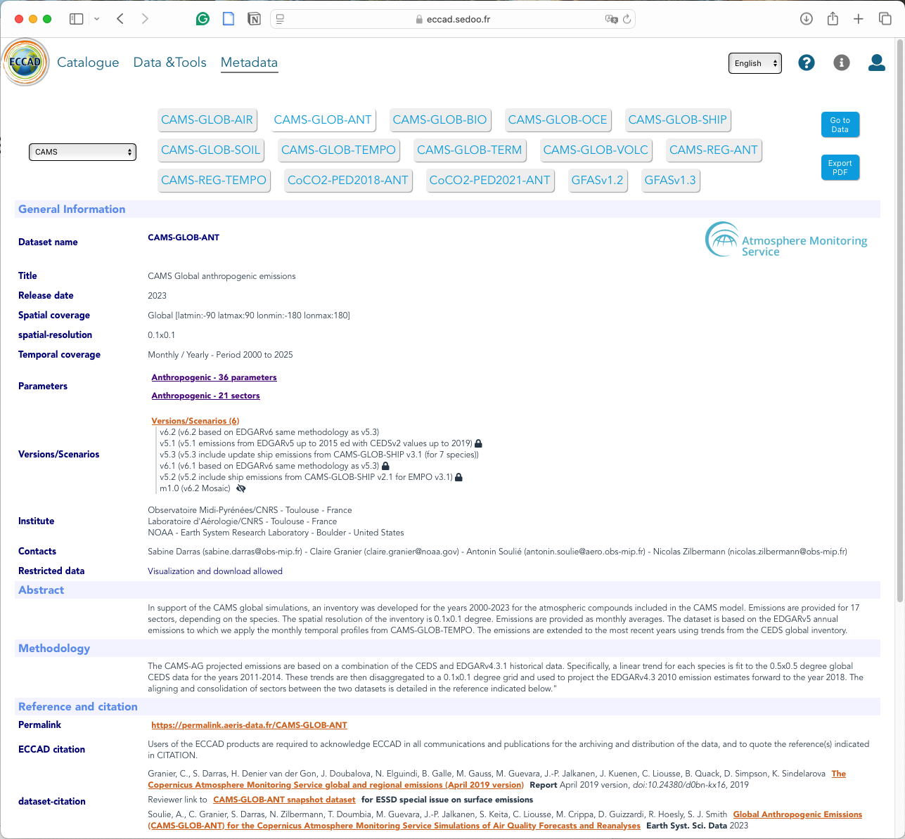
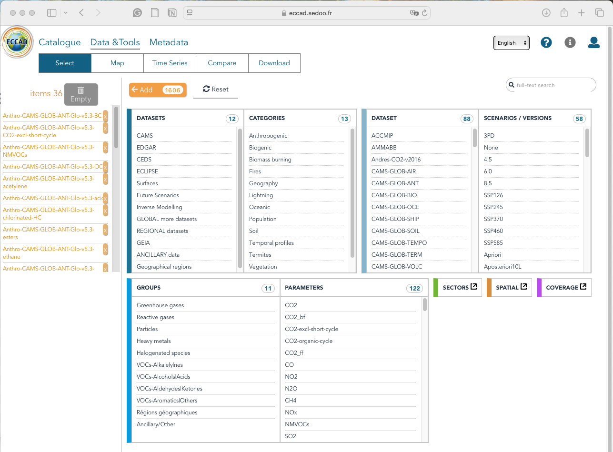
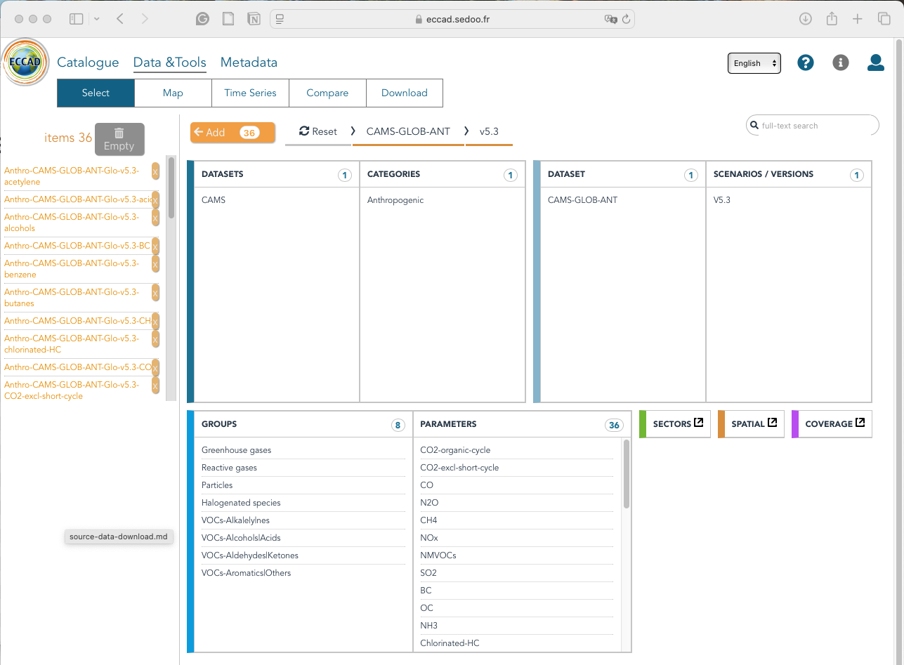
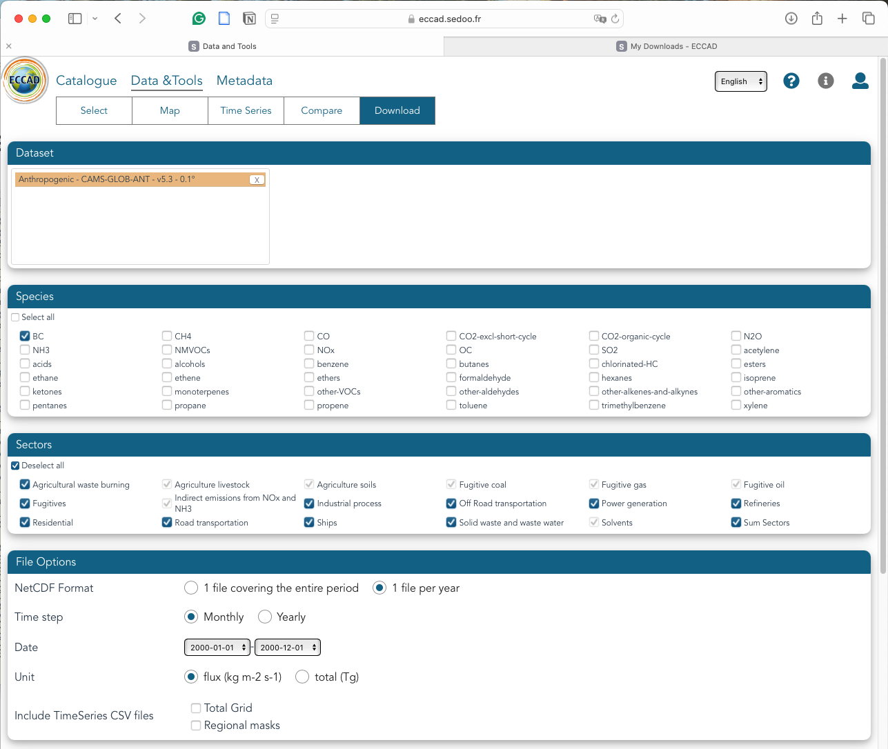
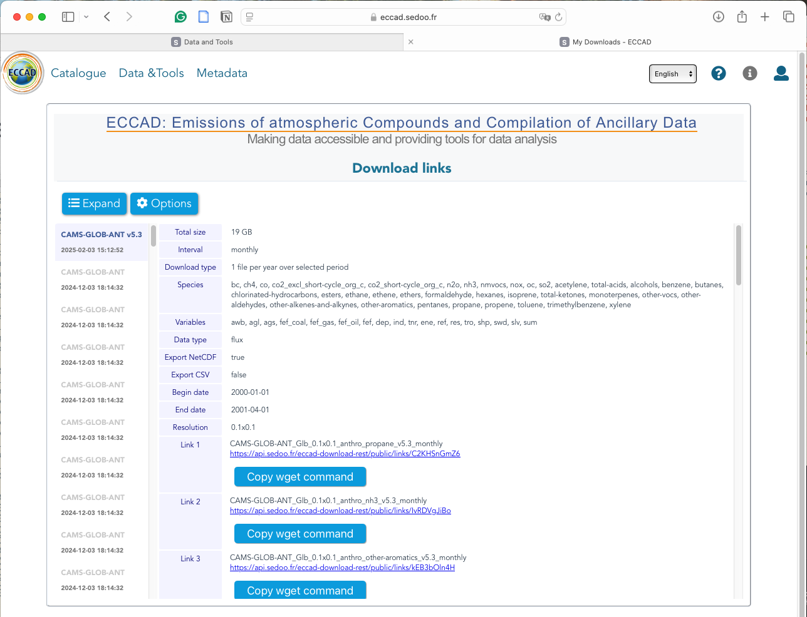
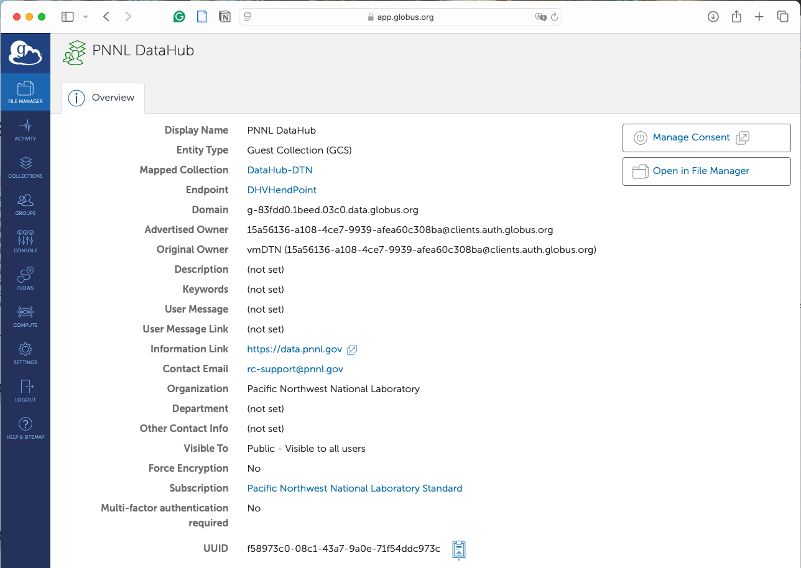
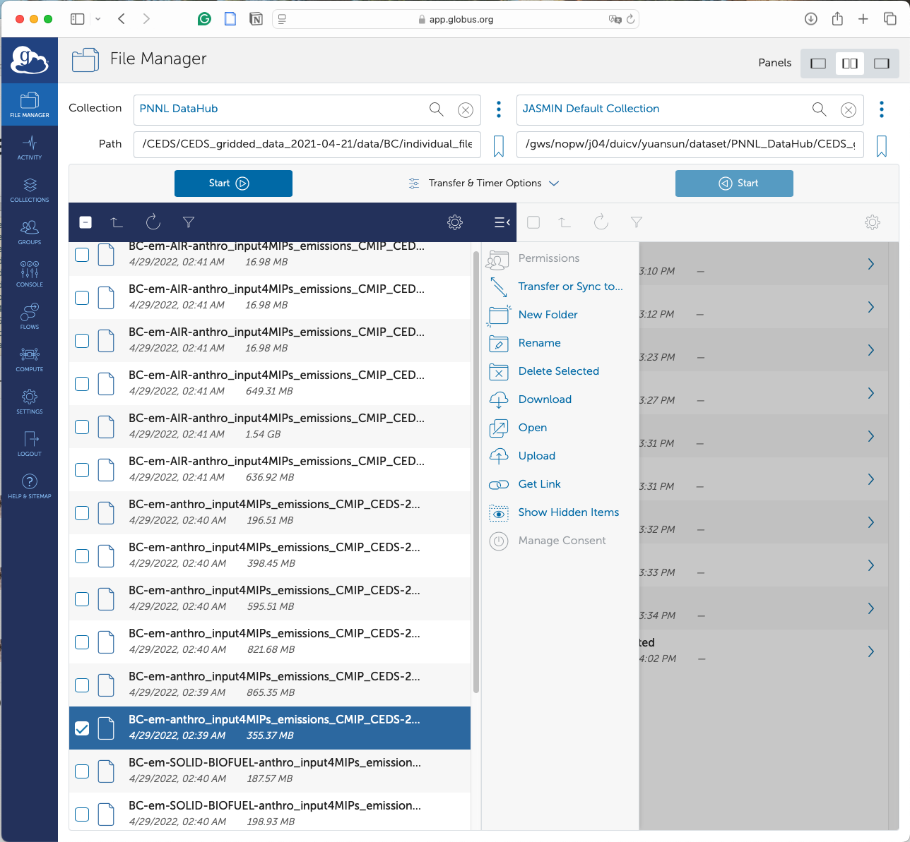

# Source Data Download

## Global Anthropogenic Emission Inventories

[CESM2](https://www.cesm.ucar.edu/models/cesm2)'s default anthropogenic emission data is based on [CEDSv2017_05_18](https://doi.org/10.5194/gmd-13-461-2020) over 1750-2100 for CMIP6, incorporating historical data up to 2014 and projection data from 2015 to 2100 under several SSP scenarios. Besides the default data, there is a rising need to use other inventories for the most recent history data, such as [CAMS-GLOB-ANT](https://permalink.aeris-data.fr/CAMS-GLOB-ANT) and [CEDSv2021_04_21](https://data.pnnl.gov/dataset/CEDS-4-21-21). 

### Comparison of Global Anthropogenic Emission Inventories

Inventories vary across different periods, release versions, spatial resolutions, and download methods (**Table 1**).

***Table 1** Comparison between CAMS-GLOB-ANT and CEDS anthropogenic emission inventories.*

| Feature            | [CAMS-GLOB-ANTv5.3](https://permalink.aeris-data.fr/CAMS-GLOB-ANT), [CAMS-GLOB-ANTv6.1](https://permalink.aeris-data.fr/CAMS-GLOB-ANT) | [CEDSv2021_04_21](https://data.pnnl.gov/dataset/CEDS-4-21-21) |
| ------------------ | ------------------------------------------------------------ | ------------------------------------------------------------ |
| Time step          | Monthly                                                      | Monthly                                                      |
| Period             | 2000-01-01 to present                                        | 1750-01-16 to 2019-12-16                                     |
| Version            | v5.3, v6.1                                                   | v2021_04_21                                                  |
| Spatial resolution | 0.1°x0.1°                                                    | 0.5°x0.5°                                                    |
| Download method    | [Wget](https://permalink.aeris-data.fr/CAMS-GLOB-ANT)        | [Globus (1750-2019)](https://www.globus.org/data-transfer), [Wget (1950-2019)](https://permalink.aeris-data.fr/CEDS) |

## Download Data Manually 

### Method1: Wget

#### [CAMS-GLOB-ANTv5.3](https://permalink.aeris-data.fr/CAMS-GLOB-ANT)

- Sign up and log in with your [ECCAD account](https://eccad.sedoo.fr).
- Visit the [CAMS-GLOB-ANT](https://eccad.sedoo.fr/#/metadata/479) webpage and click the **Go to Data** button in the top right corner (**Figure 1**).



***Figure 1** CAMS-GLOB-ANT webpage.*

<br>

- On the selection page, choose **CAMS** under DATASETS, **Anthropogenic** under CATEGORIES, **CAMS-GLOB-ANT** under DATASET, and **V5.3** under SCENARIOS / VERSIONS. Then, select the desired groups or parameters; otherwise, all parameters will be selected by default. Finally, click the **Add** button at the top to prepare for download (**Figure 2**).



***Figure 2** Select.*

<br>

- After clicking **Add**, the selected item will appear in the left panel. Then, click the **Download** button at the top (**Figure 3**). 



***Figure 3** Add.*

<br>

- Select the desired species, sectors, and file options:
  - For sectors, select **Sum Sectors** for most species, but choose all sectors for SO2. 
  - For file options, choose **1 file per year**, **Monthly**, specify the date range from January to December of a single year (e.g., 2000-01-01 to 2000-12-01), and choose **flux (kg m-2 s-1)**. 
  - Finally, scroll to the bottom of the page and click **Download** (**Figure 4**).



***Figure 4** Download.*

<br>

-  Wait for the server to process your download request. Once notified by email, go to **My Downloads** in your account at the top right corner (**Figure 5**). 



***Figure 5** Copy wget command.*

<br>

- Click **Copy wget command** and paste it into the terminal of your machine or server for data storage. The downloaded file will be named, for example, *CAMS-GLOB-ANT_Glb_0.1x0.1_anthro_propane_v5.3_monthly_2000.zip*.

  ```bash
  # Go to the directory for storing CAMS data and create a folder, for example, named CAMS-GLOB-ANTv5.3
  mkdir -p CAMS-GLOB-ANTv5.3
  cd CAMS-GLOB-ANTv5.3
  
  # Create a folder for the year 2000
  mkdir -p 2000
  
  # Below is an example of a command line copied from the webpage. It should be expired over time. 
  wget --no-check-certificate -c -t 0 --timeout=60 --waitretry=300 --content-disposition https://api.sedoo.fr/eccad-download-rest/public/links/C2KHSnGmZ6
  
  # Unzip the downloaded file and get files for a single species by year 
  unzip CAMS-GLOB-ANT_Glb_0.1x0.1_anthro_propane_v5.3_monthly.zip -d 2000
  
  # delete zip files and empty folders if necessary
  rm -rf CAMS-GLOB-ANT_Glb_0.1x0.1_anthro_propane_v5.3_monthly.zip
  ```
  

#### [CAMS-GLOB-ANTv6.1](https://permalink.aeris-data.fr/CAMS-GLOB-ANT)

Similar to CAMS-GLOB-ANTv5.3. 

#### [CEDSv2021_04_21](https://permalink.aeris-data.fr/CEDS)

The unzipped file for a single year may include two NetCDF files. Users can leave them as they are, as the code is designed to handle it. 

```
# select data from 2000-01-16 to 2000-12-16 and wget the data similarly to the above
unzip CEDS_Glb_0.5x0.5_anthro_propane__monthly.zip -d 2000

# returns 2 NetCDF files for a single year
CEDS_Glb_0.5x0.5_anthro_SO2__monthly_1999.nc # data for 2000-01-16 to 2000-02-16
CEDS_Glb_0.5x0.5_anthro_SO2__monthly_2000.nc # data for 2000-03-16 to 2000-12-06
```

- Note that the data downloaded through this method1 should be stored by year. That is, the directory structure should be organized as follows:

  /

  │── 2000/

  │  ├── CAMS-GLOB-ANT_Glb_0.1x0.1_anthro_acetylene_v5.3_monthly_2000.nc

  │  ├── *_v5.3_monthly_2000.nc

  │  ├── ......

  │── 2001/

  │  ├── *_monthly_2001.nc

  │  ├── ......

  │── ......

- Ensure that each year's data is stored in its corresponding folder. If the directory is inconsistent, the code may encounter errors due to missing data files.  

### Method2: Globus

Since the Wget method can only download CEDS data from 1950 to 2019, Globus is used to access older data from 1750 to 2019. We recommend using Globus for those familiar with the tool, as it offers more stable and faster data transfers. In contrast, Wget may encounter HTTP issues due to server limitations.

#### [CEDSv2021_04_21](https://data.pnnl.gov/dataset/CEDS-4-21-21)

- Sign up and log in with your [Globus account](https://www.globus.org/).
- Search for the **PNNL Data Hub** collection and click the **Open in File Management** button on the right (**Figure 6**). 
  - Or search by UUID: f58973c0-08c1-43a7-9a0e-71f54ddc973c



***Figure 6** PNNL DataHub in Globus.*

<br>

- Enter the **Path** on the left side, for example, */CEDS/CEDS_gridded_data_2021-04-21/data/BC/individual_files/*, and select the targeted files. On the right side, enter the destination collection (**Figure 7**). 
  - Ensure that the destination collection is an [active GLOBUS endpoint](https://docs.globus.org/guides/overviews/collections-and-endpoints/). For example, we saved CEDS data to the authors' working space on [JASMIN](https://jasmin.ac.uk/about/), a UK HPC platform supporting large-scale data analysis. 
  - Users may also save data to their local computer or other HPC platforms.



***Figure 7** Date transfer.*

<br>

- Maintain the directory structure of the downloaded data as it is in PNNL DataHub (shown on the left side of the above image).  Similarly, if the data structure is inconsistent, the code may encounter errors due to missing data files.  
- Alternatively, users can use the [GLOBUS command-line interface (CLI)](https://docs.globus.org/cli/) for data downloads, ensuring a reliable and high-performance transfer. A [bash job script](../notebooks/ceds.sh) is provided for reference. 

## List of Species Name

Species names vary across different inventories and download methods. We have standardized the species name in the regridded files for consistency (**Table 2**). 

***Table 2** Species name in the file name.*

| CAMS-GLOB-ANTv5.3, CAMS-GLOB-ANTv6.1 | CEDSv2021_04_21  | Regridded                 | Renamed        |
| ------------------------------------ | ---------------- | ------------------------- | -------------- |
| acetylene                            | VOC09-ethyne     | ethyne                    | C2H2           |
| alcohols                             | VOC01-alcohols   | alcohols                  | CH3OH, C2H5OH  |
| bc                                   | BC               | bc                        | bc_a4          |
| benzene                              | VOC13-benzene    | benzene                   | BENZENE        |
| butanes                              | VOC04-butanes    | butanes                   | BIGALK         |
| co                                   | CO               | co                        | CO             |
| esters                               | VOC18-esters     | esters                    | BIGALK         |
| ethane                               | VOC02-ethane     | ethane                    | C2H6           |
| ethene                               | VOC07-ethene     | ethene                    | C2H4           |
| ethers                               | VOC19-ethers     | ethers                    | BIGALK         |
| formaldehyde                         | VOC21-methanal   | methanal                  | CH2O           |
| hexanes                              | VOC06-hexanes-pl | hexanes                   | BIGALK         |
| nh3                                  | NH3              | nh3                       | NH3            |
| nox                                  | NOx              | nox                       | NO             |
| oc                                   | OC               | oc                        | pom_a4         |
| other-aldehydes                      | VOC22-other-alka | other-aldehydes           | CH3CHO         |
| other-alkenes-and-alkynes            | VOC12-other-alke | other-alkenes-and-alkynes | BIGENE         |
| other-aromatics                      | VOC17-other-arom | other-aromatics           | XYLENES        |
| pentanes                             | VOC05-pentanes   | pentanes                  | BIGALK         |
| propane                              | VOC03-propane    | propane                   | C3H8           |
| propene                              | VOC08-propene    | propene                   | C3H6           |
| so2                                  | SO2              | so2                       | SO2            |
| toluene                              | VOC14-toluene    | toluene                   | TOLUENE        |
| total-acids                          | VOC24-acids      | acids                     | HCOOH, CH3COOH |
| total-ketones                        | VOC23-ketones    | ketones                   | CH3COCH3, MEK  |
| trimethylbenzene                     | VOC16-trimethylb | trimethylbenzene          | XYLENES        |
| xylene                               | VOC15-xylene     | xylene                    | XYLENES        |

- The **Regridded** column denotes the name in the regridded data file name, used for renaming.
- The **Renamed** column denotes the name in the renamed data file name, used for simulation.
  - BIGALK = butanes + pentanes + hexanes + esters + ethers
  - XYLENES = xylene + trimethylbenzene + other-aromatics

### SO2

When downloading data by Wget, we suggest only the sum for most species but specify sectors for sulfate[^1]. 

- CEDSv2021_04_21 includes eight sectors—0: Agriculture (**agr**); 1: Energy (**ene**); 2: Industrial (**ind**); 3: Transportation (**tra**); 4: Residential, Commercial, Other (**res**); 5: Solvents production and application (**sol**); 6: Waste (**was**); 7: International Shipping (**shp**)—but has not yet been aggregated.
- CAMS-GLOB-ANTv5.3 includes 10 sectors—**awb**: Agricultural waste burning; **ene**: Power generation; **fef**: Fugitives; **ind**: Industry; **ref**: Oil refineries and transformation industry; **res**: Residential,  commercial and other combustion; **shp**: Ships; **swd**: Solid waste and waste water;  **tro**: Road transportation; **tnr**: Off road transportation.
- CAMS-GLOB-ANTv6.2 includes 10 sectors—**awb**: Agricultural waste burning; **com**: Commercial buildings; **ene**: Power generation; **fef**: Fugitives; **ind**: Industry; **ref**: Oil refineries and transformation industry; **res**: Residential buildings; **shp**: Ships; **tro**: Road transportation; **tnr**: Off road transportation.

***Table 3** Sectors for sulfate.*

| Filename | Related variables            | Involved CEDSv2021_04_21 sectors | Involved CAMS-GLOB-ANTv5.3 sectors | Involved CAMS-GLOB-ANTv6.2 sectors |
| -------------------------- | ---------------------------- | ---- | -------------------------- | -------------------------- |
| SO2_anthro-ag-ship-res     | emiss_ag_sol_was             | agr, sol, was | awb, swd | awb |
| SO2_anthro-ag-ship-res | emiss_res_tran               | res, tra | res, ref, fef, tro, tnr | com, res, ref, fef, tro, tnr |
| SO2_anthro-ag-ship-res | emiss_ship                   | shp | shp | shp |
| SO2_anthro-ene             | emiss_ene_ind                | ene, ind | ene, ind | ene, ind, |
| so4_a1_anthro-ag-ship      | emiss_ag_sol_was | agr, sol, was | awb, swd | awb |
| so4_a1_anthro-ag-ship | emiss_ship | shp | shp | shp |
| so4_a2_anthro-res          | emiss_res_tran               | res, tra | res, ref, fef, tro, tnr | com, ref, fef, res, tro, tnr |
| so4_a1_anthro-ene-vertical | emiss_ene_ind                | ene, ind | ene, ind | ene, ind |

# Notes

[^1]: Soulie, A., Granier, C., Darras, S., Zilbermann, N., Doumbia, T., Guevara, M., ... & Smith, S. (2024). Supplement of global anthropogenic emissions (CAMS-GLOB-ANT) for the Copernicus Atmosphere Monitoring Service simulations of air quality forecasts and reanalyses. *Supplement of Earth System Science Data*, 16(5), 2261-2279. [https://doi.org/10.5194/essd-16-2261-2024-supplement](https://doi.org/10.5194/essd-16-2261-2024-supplement)