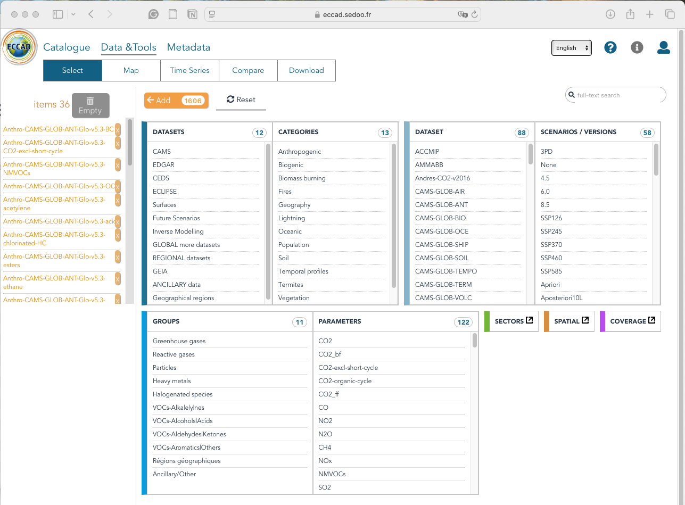
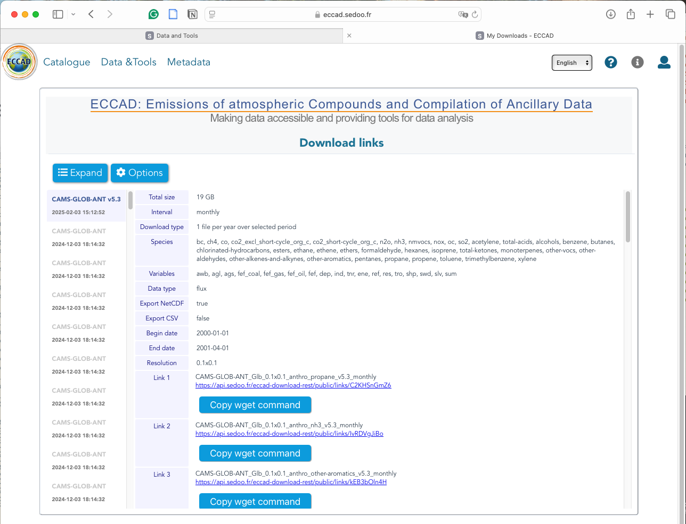

# Source Data Download

## Global Anthropogenic Inventories

[CESM2](https://www.cesm.ucar.edu/models/cesm2)'s default anthropogenic emission data is based on [CEDSv2017_05_18](https://doi.org/10.5194/gmd-13-461-2020) over 1750-2100 for CMIP6, incorporating historical data up to 2014 and projection data from 2015 to 2100 under several SSP scenarios. Besides the default data, there is a rising need to use other inventories for the most recent history data such as [CAMSv5.3](https://permalink.aeris-data.fr/CAMS-GLOB-ANT) and [CEDSv2021_04_21](https://data.pnnl.gov/dataset/CEDS-4-21-21). 

### Comparison of Global Anthropogenic Inventories

| Feature            | [CAMSv5.3](https://permalink.aeris-data.fr/CAMS-GLOB-ANT) | [CEDSv2021_04_21](https://data.pnnl.gov/dataset/CEDS-4-21-21) |
| ------------------ | --------------------------------------------------------- | ------------------------------------------------------------ |
| Time step          | Monthly                                                   | Monthly                                                      |
| Period             | 2000-01-01 to present                                     | 1750-01-16 to 2019-12-16                                     |
| Version            | v5.3                                                      | v2021_04_21                                                  |
| Spatial resolution | 0.1°x0.1°                                                 | 0.5°x0.5°                                                    |
| Download method    | [Wget](https://permalink.aeris-data.fr/CAMS-GLOB-ANT)     | [Globus](https://www.globus.org/data-transfer)               |

## Download Data Manually 

### [CAMSv5.3](https://permalink.aeris-data.fr/CAMS-GLOB-ANT)

- Sign up and log in with your [ECCAD account](https://eccad.sedoo.fr).
- Visit the [CAMS-GLOB-ANT](https://eccad.sedoo.fr/#/metadata/479) webpage and click the **Go to Data** button in the top right corner.


<br><br>

- On the selection page, choose **CAMS** under DATASETS, **Anthropogenic** under CATEGORIES, **CAMS-GLOB-ANT** under DATASET, and **V5.3** under SCENARIOS / VERSIONS. Then, select the desired groups or parameters; otherwise, all parameters will be selected by default. Finally, click the **Add** button at the top to prepare for download.


<br><br>

- After clicking **Add**, the selected item will appear in the left panel. Then, click the **Download** button at the top. 


<br><br>

- Select the desired species, sectors, and file options:
  - For sectors, select **Sum Sectors** for most species, but select all sectors for SO2. 
  - For file options, choose **1 file per year**, **Monthly**, specify the date range from January to December of a single year (e.g., 2000-01-01 to 2000-12-01), and choose **flux (kg m-2 s-1)**. 
  - Finally, scroll to the bottom of the page and click **Download**.


<br><br>

-  Wait for the server to process your download request. Once notified by email, go to **My Downloads** in your account at the top right corner. 


<br><br>

- Click **Copy wget command** and paste it into the terminal of your machine or server for data storage. The downloaded file will be named, for example, *CAMS-GLOB-ANT_Glb_0.1x0.1_anthro_propane_v5.3_monthly_2000.zip*.

  ```bash
  # Go to the directory for storing CAMS data and create a folder, for example, named CAMS-GLOB-ANTv5.3
  mkdir CAMS-GLOB-ANTv5.3
  cd CAMS-GLOB-ANTv5.3
  
  # Create a folder for the year 2000
  mkdir -p 2000
  
  # Below is an example of a command line copied from the webpage. It should be expired over time. 
  wget --no-check-certificate -c -t 0 --timeout=60 --waitretry=300 --content-disposition https://api.sedoo.fr/eccad-download-rest/public/links/C2KHSnGmZ6
  
  # Unzip the downloaded file and get files for a single species by year 
  unzip CAMS-GLOB-ANT_Glb_0.1x0.1_anthro_propane_v5.3_monthly.zip
  
  # Move files into the corresponding year folder
  mv CAMS-GLOB-ANT_Glb_0.1x0.1_anthro_propane_v5.3_monthly/CAMS-GLOB-ANT_Glb_0.1x0.1_anthro_propane_v5.3_monthly_2000.nc 2000/
  
  # delete zip files and empty folders if necessary
  rm -rf CAMS-GLOB-ANT_Glb_0.1x0.1_anthro_propane_v5.3_monthly
  rm -rf CAMS-GLOB-ANT_Glb_0.1x0.1_anthro_propane_v5.3_monthly.zip
  ```

  - Note that the data is download and stored by year. The directory structure should be organized as follows:

    /

    │── 2000/

    │  ├── *_monthly_2000.nc

    │  ├── ......

    │── 2001/

    │  ├── *_monthly_2001.nc

    │  ├── ......

    │── ......

  - Ensure that each year's data is stored in its corresponding folder. If the directory is inconsistent, the code may encounter errors due to missing data files.  

### [CEDSv2021_04_21](https://data.pnnl.gov/dataset/CEDS-4-21-21)

- Sign up and log in with your [Globus account](https://www.globus.org/).
- Search for the **PNNL Data Hub** collection and click **Open in File Management** bottom on the right. 
  - Or search by UUID: f58973c0-08c1-43a7-9a0e-71f54ddc973c


<br><br>

- Enter the **Path** on the left side, for example, */CEDS/CEDS_gridded_data_2021-04-21/data/BC/individual_files/*, and select the targeted files. On the right side, enter the destination collection. 
  - Ensure that the desitimation collection is an [active GLOBUS endpoint](https://docs.globus.org/guides/overviews/collections-and-endpoints/). For example, we saved CEDS data to authors' working space on [JASMIN](https://jasmin.ac.uk/about/), a UK HPC platform supporting large-scale data analysis. 
  - Users may also choose to save data to their local computer or other HPC platforms.


<br><br>

- Maintain the directory structure of the downloaded data as it is in PNNL DataHub (shown on the left side of the above image).  Similarly, if the data structure is inconsistent, the code may encounter errors due to missing data files.  
- Alternatively, users can use the [GLOBUS command-line interface (CLI)](https://docs.globus.org/cli/) for data downloads, ensuring a reliable and high-performance transfer. A [bash job script](../notebooks/ceds.sh) is provided for reference. 

